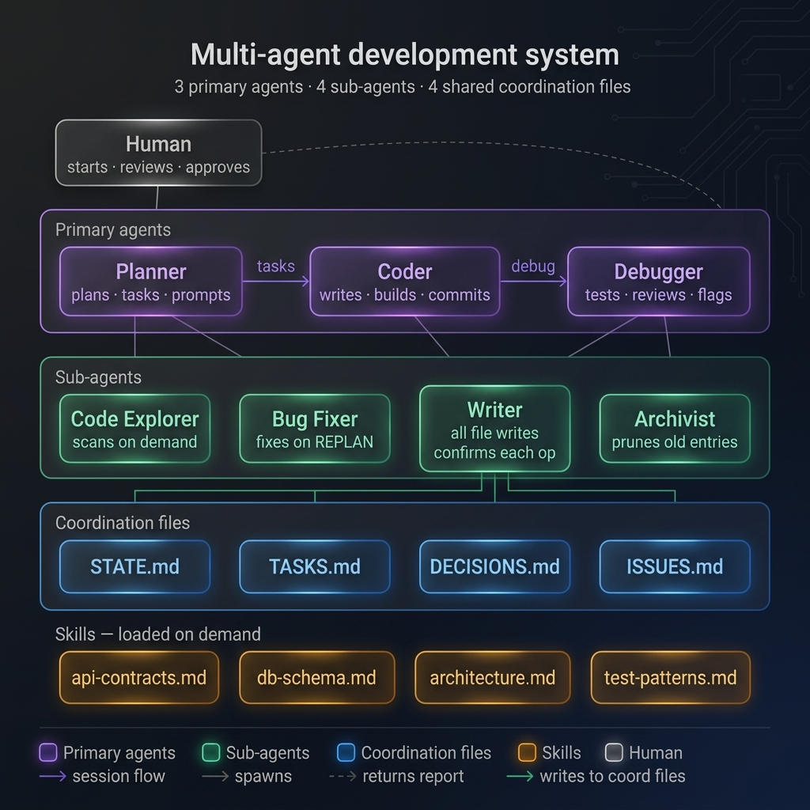

# Multi-Agent Development System

A structured, prompt-based multi-agent system for software development. Three primary agents — **Planner**, **Coder**, and **Debugger** — coordinate through shared files. Sub-agents handle focused tasks: writing coordination files, archiving, bug fixing, and code exploration. All work is reviewed and approved by a Human at every checkpoint.

> Built for use with [opencode](https://opencode.ai) or any LLM tool that supports loading markdown agent prompts.

---

## Architecture Overview




- **Planner** reads project state and produces focused task prompts
- **Coder** implements exactly one task per session, commits, and signals done
- **Debugger** runs two verification passes (tests + static analysis) after every batch
- **Writer** is the only agent that writes to coordination files — via structured `<write_request>` blocks
- **Archivist** prunes active files after every debug pass
- **Bug Fixer** handles CRITICAL bugs on Planner's instruction

Full protocol in [`ARCHITECTURE.md`](./ARCHITECTURE.md).

---

## Using this for a new project

### 1. Clone the repo
```bash
git clone https://github.com/your-username/multi-agent-architecture.git my-project-agents
cd my-project-agents
```

### 2. Fill in the skill files
These are the only files you need to customise. Each has `[placeholder]` markers:

| File | What to fill in |
|---|---|
| `skills/architecture/SKILL.md` | Your product name, stack, file structure, layer rules |
| `skills/api-contracts/SKILL.md` | Your API base URL, endpoints, auth scheme |
| `skills/db-schema/SKILL.md` | Your database, ORM, tables, query patterns |
| `skills/test-patterns/SKILL.md` | Your test structure, naming, run commands |
| `docs/ARCHITECTURE.md` | Full architecture reference for agents |
| `docs/API_CONTRACTS.md` | Full endpoint reference for agents |
| `docs/DATABASE_SCHEMA.md` | Full schema reference for agents |

> **Tip:** `skills/` files are the short, agent-loaded versions. `docs/` files are the full reference. Both should be kept in sync.

### 3. Configure your models (optional)
Edit `opencode.json` to assign models to each agent role:
```json
"agent": {
  "planner":  { "model": "..." },
  "coder":    { "model": "..." },
  "debugger": { "model": "..." },
  ...
}
```

### 4. Start your first session
Open the `agents/planner .md` prompt in your LLM tool. Planner will read `coordination/STATE.md` and guide you through the rest.

---

## File map

```
/
├── ARCHITECTURE.md          full system protocol (read this first)
├── opencode.json            agent-to-model assignments
│
├── agents/                  agent prompt files (load into your LLM tool)
│   ├── planner .md
21:   ├── coder.md
22:   ├── debugger.md
23:   ├── writer.md
24:   ├── archivist.md
25:   ├── bug-fixer.md
26:   └── graph-explorer.md
│
├── commands/                reusable slash commands
│   └── bootstrap.md
│
├── coordination/            shared project state (agents read/write via Writer)
│   ├── STATE.md             current snapshot — max 30 lines
│   ├── TASKS.md             active queue + current batch
│   ├── DECISIONS.md         architectural decisions (never deleted)
│   ├── ISSUES.md            bugs, clarifications, debug logs
│   ├── TASKS_ARCHIVE.md     full task history (Archivist only)
│   └── ISSUES_ARCHIVE.md    full bug history (Archivist only)
│
├── skills/                  compact domain knowledge — loaded on demand
│   ├── api-contracts/SKILL.md
│   ├── architecture/SKILL.md
│   ├── db-schema/SKILL.md
│   └── test-patterns/SKILL.md
│
├── skills-template/         blank templates for each skill file
│   └── ...
│
├── docs/                    full reference docs — linked from skill files
│   ├── ARCHITECTURE.md
│   ├── API_CONTRACTS.md
│   └── DATABASE_SCHEMA.md
│
└── hooks/
    └── on-ticket-closed.sh  fires git push when a ticket is closed
```

---

## Session flow (quick reference)

1. Human starts **Planner** session
2. Planner reads state → prints session summary → Human approves
3. Planner writes tasks via **Writer**
4. Human pastes task prompts into **Coder** one at a time
5. Coder commits → spawns **Writer** to update TASKS.md
6. Human pastes debug prompt into **Debugger**
7. Debugger runs Pass 1 (tests + criteria) + Pass 2 (security + conventions) → spawns **Writer**
8. **Archivist** prunes active files
9. If PASSED → start next Planner session
10. If REPLAN-NEEDED → Planner spawns **Bug Fixer** → Debugger re-checks

---

## License

MIT
